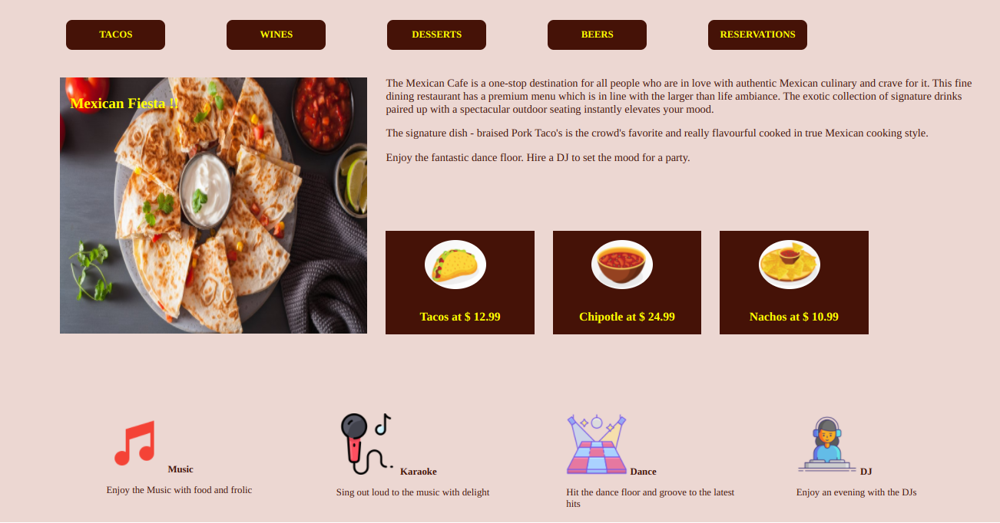

# Mexican Cafe

## Context

Mexican Cafe is a one-stop destination for all people who are in love with authentic Mexican culinary and crave for it. This fine dining restaurant has a premium menu which is in line with the larger than life ambiance. The exotic collection of signature drinks paired up with a spectacular outdoor seating instantly elevates your mood.

The signature dish - braised Pork Taco's is the crowd's favorite and really flavourful cooked in true Mexican cooking style. This place is really amazing and one of the best Mexican restaurants and should definitely be on your must-visit list! 

As a Frontend Developer, you would have to create a Web Page to showcase all the restaurant services by laying out information in a way that is quickly usable and readable to help Mexican Cafe reach a wider audience.

## Problem Statement

 Build a web page that displays the information about the restaurant like menu, specialties, reviews on food, etc. to the customers and the attractions at the restaurant. The web page should resemble the below image.



### Tasks

- The solution for this challenge can be developed in 3 stages:​
    - Stage 1 :: Create a Header​
    - Stage 2 :: Create the Main section​
    - Stage 3 :: Create a Footer​
- Edit the `index.html` file to add various HTML elements.​
- Define styles inside `style.css` file located in the `css` folder.

### Recommendations For Using CSS Floats 

- The header items must be created using the semantic `header` tag and all the menu items must float left with the suggested background color.​
- All the menu items in the header should be hyperlinks.​
- In the main section ​
    - Wrap the image and text by using CSS floats.​
    - Embed text over the image at the top left corner by using the CSS position property​
- The footer section should be created using the semantic `footer` tag.​
- The footer must show the activities that are prevalent in the restaurant.​
- Use CSS floats in the footer to wrap the text and the images.​

### Details

- Color codes used frequently in this web page are:
    - #ecd7d2
    - #451207
    - yellow
- All the required images to build the web page are available inside the `assets` folder.
- Text used in the web page are as follows:
```
The Mexican Cafe is a one-stop destination for all people who are in love with authentic Mexican culinary and crave for it. This fine dining restaurant has a premium menu which is in line with the larger than life ambiance. The exotic collection of signature drinks paired up with a spectacular outdoor seating instantly elevates your mood.

The signature dish - braised Pork Taco's is the crowd's favorite and really flavourful cooked in true Mexican cooking style.

Enjoy the fantastic dance floor. Hire a DJ to set the mood for a party.

Enjoy the Music with food and frolic

Sing out loud to the music with delight

Hit the dance floor and groove to the latest hits

Enjoy an evening with the DJs
```

